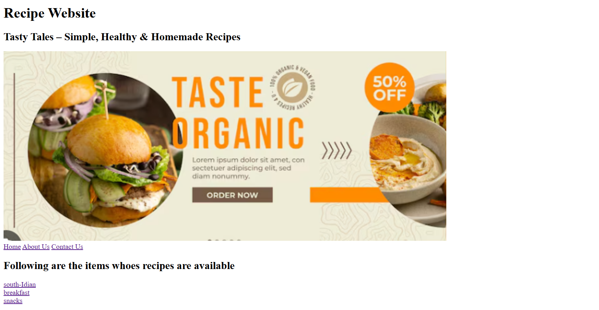
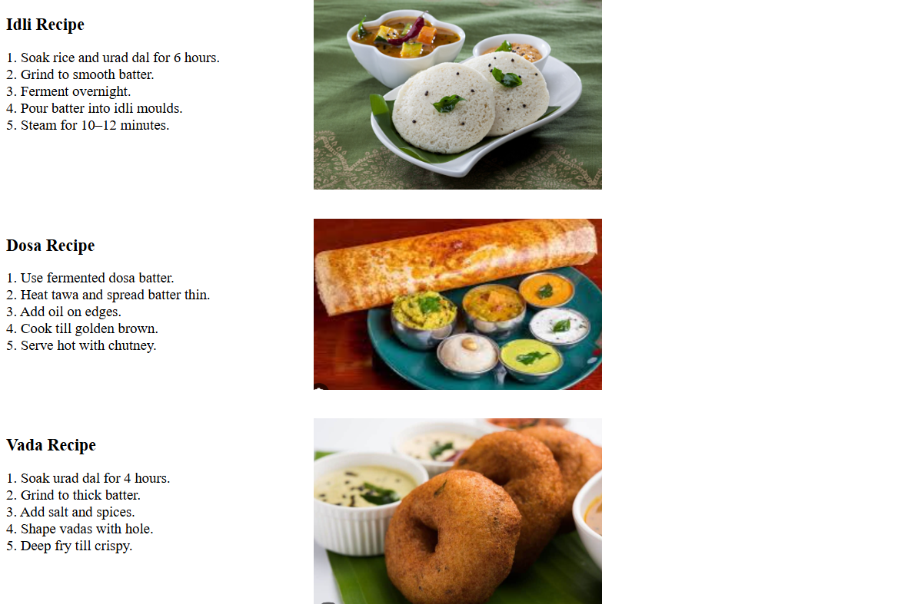

# 🍽️ Live Recipe Website

This is a simple and responsive **Recipe Website** created using **HTML and CSS**.  
The website displays different food categories and recipe pages in a clean UI.

---

## 📌 Features
- Home page with food categories
- Separate recipe pages
- Simple and user-friendly design
- Image-based navigation
- Static website (Beginner friendly)

---

## 🛠️ Technologies Used
- HTML5
- CSS3
- Images (PNG)

---

## 📸 Website Preview

### 🧩 Dashboard Page

---

### 🍲 Recipe Page

---

## 📂 Project Structure
